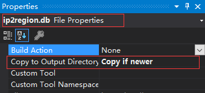
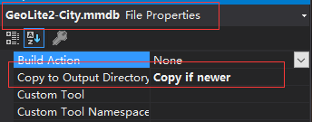

# IPTools
快速查询IP信息，支持国内和国外IP信息查询，支持查询经纬度，地理位置最高支持到城市。

## 1. IPTools.China

快速查询中国IP地址信息，包含国家、省份、城市、和网络运营商。非中国IP只支持查询国家。

### (1) 安装

````shell
Install-Package IPTools.China
````

### (2) 下载数据库文件

````shell
https://github.com/stulzq/IPTools/raw/master/db/ip2region.db
````
将数据库文件下载完成以后，放到你的项目根目录(与*.csprj文件同级)，并**设置复制到输出目录**




>1.2.0版本开始就取消了将数据库文件嵌入到程序集，方便更新，且减少程序集大小。
### (3) 使用

````shell
IpTool.Search("你的ip地址");
````

示例.

````csharp
var ipinfo = IpTool.Search("171.210.12.163");
Console.WriteLine(ipinfo.Country); // 中国
Console.WriteLine(ipinfo.Province); // 四川省
Console.WriteLine(ipinfo.City); // 成都市
Console.WriteLine(ipinfo.NetworkOperator);// 电信
````

### (4) 国际化

不支持国际化，所以不能使用`IpTool.SearchWithI18NAsync()`。

### (5) 性能测试

单线程，双重for循环，查询65025个IP，花费170毫秒。

### (6) 自定义ip数据库文件

````csharp
IpToolSettings.ChinaDbPath="";
````

## 2. IPTools.International

快速查询全球IP信息，支持多语言，地理信息包括国家、省份、城市、邮政编码、纬度和精度。

### (1) 安装

```shell
Install-Package IPTools.International
```

### (2) 下载数据库文件

```shell
https://github.com/stulzq/IPTools/raw/master/db/GeoLite2-City.mmdb
```

将数据库文件下载完成以后，放到你的项目根目录(与*.csprj文件同级)，并**设置复制到输出目录**



> 1.2.0版本开始就取消了将数据库文件嵌入到程序集，方便更新，且减少程序集大小。

### (3) 使用

````csharp
IpTool.Search("你的ip地址");
````

示例.

````csharp
var ipinfo = IpTool.SearchWithI18N("171.210.12.163");
Console.WriteLine(ipinfo.Country); // 中国
Console.WriteLine(ipinfo.CountryCode); // CN
Console.WriteLine(ipinfo.Province); // 四川省
Console.WriteLine(ipinfo.ProvinceCode); // SC
Console.WriteLine(ipinfo.City); // 成都
Console.WriteLine(ipinfo.Latitude); // 30.6667
Console.WriteLine(ipinfo.Longitude); // 104.6667
Console.WriteLine(ipinfo.AccuracyRadius);// 50
````

### (4) 国际化

````csharp
IpTool.SearchWithI18N("你的ip地址");
````

示例.

````csharp
var ipinfo = IpTool.SearchWithI18N("171.210.12.163","en");//如果不设置 language code, 默认将会使用中文
Console.WriteLine(ipinfo.Country); // China
Console.WriteLine(ipinfo.CountryCode); // CN
Console.WriteLine(ipinfo.Province); // Sichuan
Console.WriteLine(ipinfo.ProvinceCode); // SC
Console.WriteLine(ipinfo.City); // Chengdu
Console.WriteLine(ipinfo.Latitude); // 30.6667
Console.WriteLine(ipinfo.Longitude); // 104.6667
Console.WriteLine(ipinfo.AccuracyRadius);// 50
````

默认语言为中文，如何改变？使用下面的代码进行设置。中文为 `zh-CN`，英文为`en`

````csharp
IpToolSettings.DefaultLanguage = "en";
````

### (5) 提升查询速度

通过以下设置，将会**提升一倍的查询速度**，其原理是将数据库文件完全加载到内存，付出的代价是内存将会增加60-70M，以空间换时间，这点需要注意。

````csharp
IpToolSettings.LoadInternationalDbToMemory = true;
````

> 版本要求 >= 1.2.0

### (6) 性能测试

单线程，双重for循环，查询65025个IP，花费1500毫秒（Memory）。

### (7) 自定义ip数据库文件

````csharp
IpToolSettings.InternationalDbPath="";
````

## 3. ASP.NET Core 支持

IPTools 提供了 `HttpContext`对象的扩展方法。

使用:

````csharp
HttpContext.GetRemoteIpInfo();
HttpContext.GetRemoteIpInfo(headerKey); // 从请求头获取ip地址信息，如果你使用了nginx、haproxy等代理
````

## 4. 同时使用 IPTools.China 和 IPTools.International

IPTools.China 和 IPTools.International 都实现了` IIpSearcher`，`IpTool`类在加载时会检测你所安装的程序包进行初始化，且仅仅初始化一次。`IpTool`具有三个静态只读属性，分别是 `DefaultSearcher`、`IpChinaSearcher`、`IpAllSearcher`。

- `DefaultSearcher`。`IpTool.Search()` 和 `IpTool.SearchWithI18N()` 将会使用的默认Ip搜索器。
- `IpChinaSearcher`。对应 IPTools.China 实现的搜索器。
- `IpAllSearcher`。对应 IPTools.International 实现的搜索器。

如果你只是安装了 IPTools.China 那么，`DefaultSearcher` 将会是 `IpChinaSearcher`，`IpAllSearcher`将会为 null。

如果你只是安装了 IPTools.International 那么，`DefaultSearcher` 将会是 `IpAllSearcher`，`IpChinaSearcher`将会为 null。

如果你同时安装了以上两个组件，那么默认情况下 `DefaultSearcher` 将会是 `IpChinaSearcher`，`IpChinaSearcher` 和 `IpAllSearcher` 都不会为null。

改变`DefaultSearcher` 所使用的默认 Searcher 请使用下面的代码，如果你同时安装了两个组件才会生效。

````csharp
IpToolSettings.DefalutSearcherType = IpSearcherType.China;
IpToolSettings.DefalutSearcherType = IpSearcherType.International;
````

## 5. 使用的开源项目

[**ip2region**](https://github.com/lionsoul2014/ip2region) by [lionsoul2014](https://github.com/lionsoul2014).

[**GeoIP2-dotnet**](https://github.com/maxmind/GeoIP2-dotnet) by [maxmind](https://github.com/maxmind).